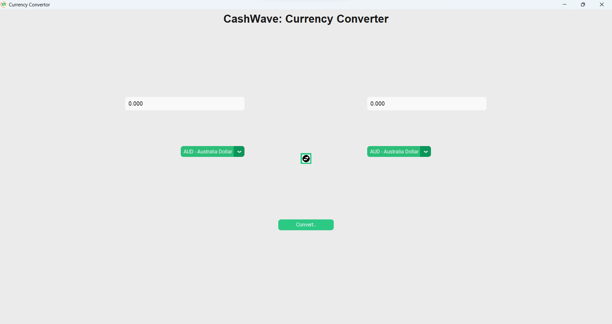

# CashWave Currency Converter

Welcome to the CashWave Currency Converter repository! This repository contains a Python-based graphical application that allows users to convert between different currencies using real-time exchange rates.

## Table of Contents
- [About](#about)
- [Features](#features)
- [Installation](#installation)
- [Usage](#usage)
- [Screenshots](#screenshots)
- [Dependencies](#dependencies)

## About
CashWave Currency Converter is a user-friendly currency conversion tool built using Python. It provides an intuitive graphical interface for users to quickly convert between various currencies based on the latest exchange rates.

## Features
- User-friendly graphical interface.
- Real-time currency conversion using the `forex_python` library.
- Option to select source and destination currencies.
- Swap button to quickly switch between source and destination currencies.

## Installation
1. Clone the repository to your local machine:
   ```bash
   git clone https://github.com/your-username/cashwave-currency-converter.git

## Usage
To use the CashWave Currency Converter application, follow these steps:

1. **Enter the Amount:** Open the application and enter the amount you want to convert in the input text box.

2. **Select Currencies:** Choose the source currency from the left dropdown menu (labeled "From") and the destination currency from the right dropdown menu (labeled "To").

3. **Perform Conversion:** Click the "Convert" button to initiate the currency conversion. The converted amount will be displayed in the output text box.

4. **View Conversion Result:** The converted amount will be shown in the output text box with the corresponding currency code.

5. **Quick Currency Switch:** To quickly switch the source and destination currencies, click the swap icon located between the two dropdown menus.

## Screenshots
Here are some screenshots of the CashWave Currency Converter application in action:


*Python based GUI.*

## Dependencies
The CashWave Currency Converter relies on the following external libraries and packages:

- [customtkinter](https://github.com/MrMimic/customtkinter)
- [forex-python](https://github.com/MicroPyramid/forex-python)
- [Pandas](https://pandas.pydata.org/)
- [Pillow](https://python-pillow.org/)

Make sure to install these dependencies before running the application. You can install them using the following command:

```bash
pip install customtkinter forex-python pandas Pillow
